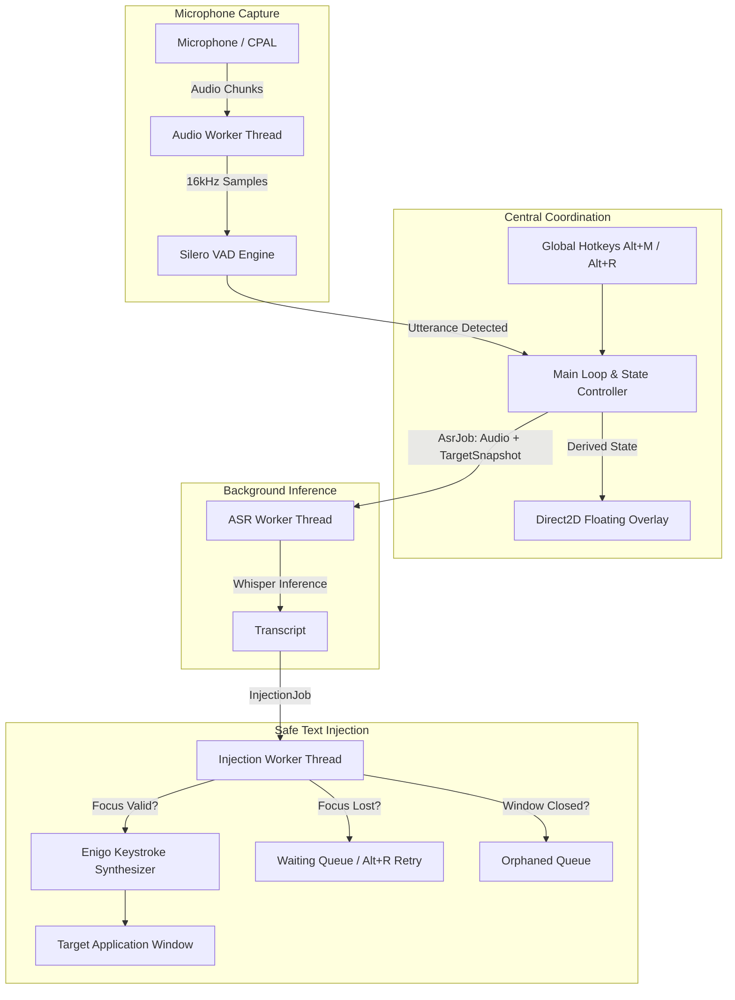

## High-Level Pipeline Architecture

```mermaid
flowchart TD
    subgraph Microphone Capture
        MIC[Microphone / CPAL] -->|Audio Chunks| AW[Audio Worker Thread]
        AW -->|16kHz Samples| VAD[Silero VAD Engine]
    end

    subgraph Central Coordination
        VAD -->|Utterance Detected| MAIN[Main Loop & State Controller]
        HK[Global Hotkeys Alt+M / Alt+R] --> MAIN
        MAIN -->|Derived State| UI[Direct2D Floating Overlay]
    end

    subgraph Background Inference
        MAIN -->|AsrJob: Audio + TargetSnapshot| ASR[ASR Worker Thread]
        ASR -->|Whisper Inference| TX[Transcript]
    end

    subgraph Safe Text Injection
        TX -->|InjectionJob| INJ[Injection Worker Thread]
        INJ -->|Focus Valid?| ENIGO[Enigo Keystroke Synthesizer]
        INJ -->|Focus Lost?| WQ[Waiting Queue / Alt+R Retry]
        INJ -->|Window Closed?| OQ[Orphaned Queue]
        ENIGO --> APP[Target Application Window]
    end
```